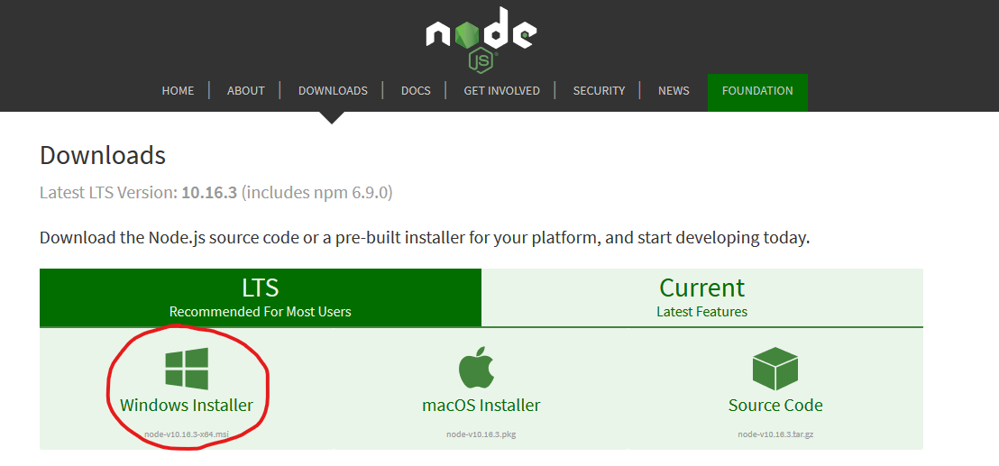
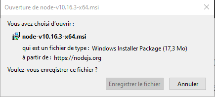
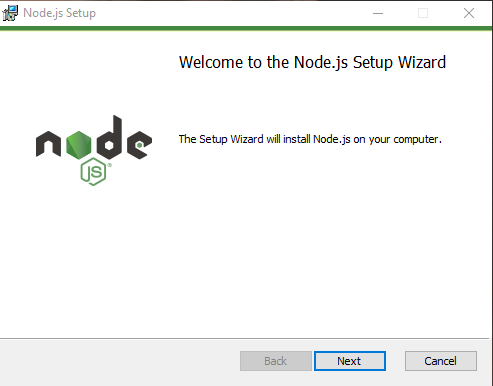
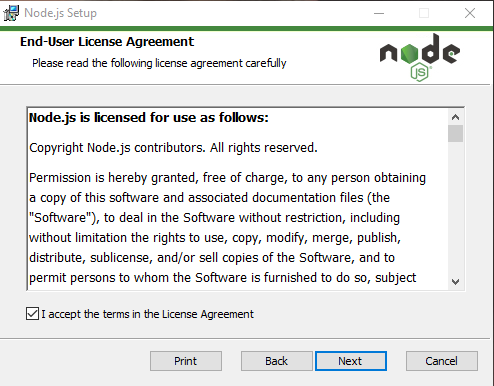
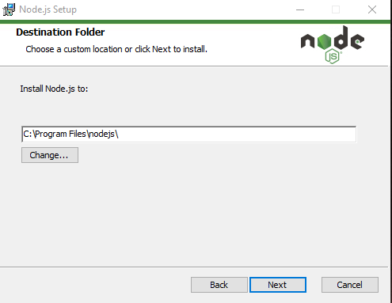
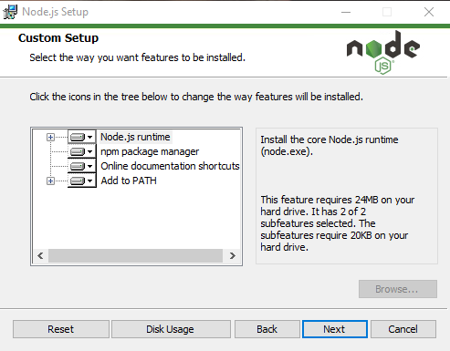
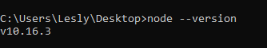

# Workshop sur ReactJS

### Ce workshop a été réalisé par:

- Frédérick Van Isschot
- Cindy Buchet
- Lesly Ghyselinck

Ce workshop va faire un rappel sur les bases de ReactJS pour ensuite vous lancer sur React Native.

Avant de commencer à jouer avec React, vous devez savoir certaines choses à l'avance. Alors suivez-bien !

---

## La table des matières

1. Introduction
2. Le DOM
3. Création du projet
4. La structure
5. Les components
6. Les states
7. Board
8. La final
9. Bonus

Déjà avant tout chose, passons par la case « installation ».
Pour pouvoir coder avec React il vous faut impérativement avoir NodeJs sur votre machine.

Je vous invite donc à suivre les étapes suivantes, pour ceux qui ont déjà Node.js sur leur machine. Je vous invite donc à passer l'étape de l'installation et à vous rendre dans le [bas de la page](#version).

## Installation sur linux

Installer Nodejs sous Ubuntu, il suffit d'installer les paquets nodejs et npm.

Dans votre terminal, entrez ces lignes :

```
sudo apt-get update
sudo apt-get install nodejs npm
```
Mais n'hésitez pas à suivre la [doc](https://doc.ubuntu-fr.org/nodejs) de ubuntu.

OU

Vous pouvez aussi suivre ce [tuto youtube](https://www.youtube.com/watch?v=sIfk8hpRLUg) .

---

## Installation sur Windows

Rendez-vous sur le site officiel : [site NodeJs](https://nodejs.org/en/download/) comme ceci :


Étape 1:



Étape 2:



Étape 3:



Étape 4:



Étape 5:



Étape 6:



---

## Installation sur Mac

Rendez-vous sur le site officiel : [site NodeJs](https://nodejs.org/en/download/) et suivez les étapes !

Étape 1:


## Déjà installer ? Vérifie ta version <a id="version"></a>

Pour ceux qui aurait déjà NodeJs installé veuillez vérifier la version que vous avez sur votre machine en entrant cette ligne dans votre terminal.

```
node --version
```

Vous avez tous une version 10 de NodeJs, comme ceci.



---

Alors c'est parti ! (Sinon repasse par l'étape 'installation' ! Et que ça saute !!)


[=> Introduction](markdown/01-intro.md)