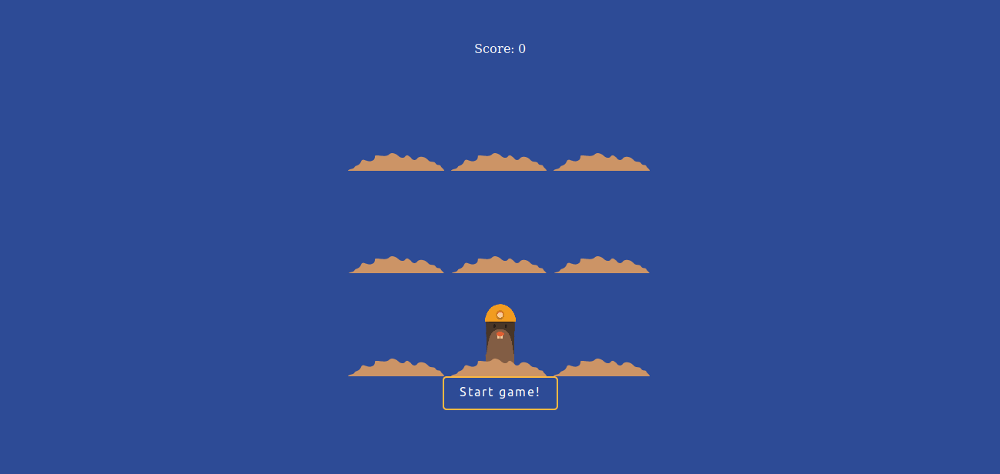

# Introduction
Avant de commencer à jouer avec React, vous devez savoir certaines choses à l'avance. Si vous n'avez jamais utilisé JavaScript ou les DOM je me familiariserais d'avantage avec ceux-ci avant d'essayer d'utiliser React. Mais à notre niveau nous savons tous ce que c'est non ?!

## Vous inquiettez pas un rappel est prévu pour tout !

Evidemment tout le monde code en Es6 , hein ? Au cas ou vous auriez oublié 2 ou 3 choses, le lien ici est trés intéréssant pour vous remettre dans le bain :
[Becode Parcours Javascript](https://github.com/becodeorg/CRL-Turing-3.11/tree/master/Parcours/04-Javascript)

## C'est quoi ReactJS ?

React est une bibliothèque JavaScript les plus populaires, avec plus de 100 000 étoiles sur GitHub. React a développée par Facebook depuis 2013.

React est utilisé pour construire des interfaces utilisateur (UI) sur le front-end , c'est aussi la couche de vue d'une application MVC (Model View Controller).

L'un des aspects les plus importants de React est le fait que vous pouvez créer des componants, tels que des éléments HTML personnalisés et réutilisables, afin de créer rapidement et efficacement des interfaces utilisateur. React rationalise également la manière dont les données sont stockées et traitées, à l'aide de l'état et des accessoires.

## Les prérequis pour utiliser ReactJS

* Connaissance de base avec HTML et CSS .
* Connaissance de base de JavaScript et de la programmation.
* Compréhension de base du DOM .
* Familiarité avec la syntaxe et les fonctionnalités de ES6 .
* Node.js et npm installés globalement.

## Buts
* Découvrez les concepts essentiels de React et les termes associés, tels que Babel, Webpack, JSX, les composants, les accessoires, l'état et le cycle de vie.
* Construisez une application React très simple qui illustre les concepts ci-dessus.

## Ce que vous allez devoir faire
Aperçu:

# Allez Bonne chance !!!

[=> Chapitre suivant](02-DOM.md)