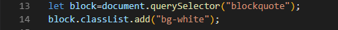

# Le DOM  (Document Object Model)

### Petit rappel sur ce qu'est le DOM ! (Ohh nonnn !! Et bien si !)
Non tu es sûr ?? Ok alors passe ce petit [chapitre](#terminer)!!

---

## Do not panic !

### Ce n'est qu'un petit rappel

Vous savez déjà qu'une page web est un document contenant du texte ainsi que des balises qui permettent de structurer ce document, en décrivant des éléments comme des titres, des paragraphes, des liens, etc...

Le DOM  est un moyen de manipuler la structure et le style d'une page HTML .
Les éléments qui le forment ont une structure de noeuds avec des parents et des enfants.
Pour vous donner un exemple c'est un peu comme un arbre , un tronc et des branches . Il y a un élément racine (html) qui est le tronc et le "head" formera une branche ainsi que le body en fera une autre et sur ses branches se créeront d'autres branches ainsi de suite (comme dans l'illustration suivante).

En voici un petit exemple : 

Pour cette raison, le DOM est aussi appelé l'arbre DOM.
La modification du DOM se fait en choisissant un élément et en changeant quelque chose à son sujet. C’est une action que l’on fait souvent en JavaScript. Pour accéder au DOM à partir de JavaScript, l'objet document est utilisé. Il est fourni par le navigateur et permet au code sur la page d'interagir avec le contenu.

---

## Obtenir un élément

Tout d'abord, nous devons savoir comment obtenir/sélectionner un élément à modifier.

### A quoi ça sert ?

L'élément selectionné peut alors être manipulé. Sa taille et la couleur peuvent être modifiées par exemple, ou on peut remplacer le code déclaré et aussi gérer l'élément quand on clique dessus ou quand il est survolé. Nous pouvons aussi modifier du texte.
Bref, vous l'avez compris on peut faire beaucoup de choses !

Il y a 4 façons d'y parvenir:

## 1. Par l'ID (identifiant)

Il faut commencer par sélectionner l'ID qui nous intéresse et pour cela il faut passer par:

 `document.getElementById('NomDeVotreId'); // ne sélectionne que l'identifiant demandé => id="NomDeVotreId" `

Exemple :

## 2. Par le nom de la Class

 A la place de sélectionner un ID , ici ce sera la class comme ceci: 
 
 `document.getElementsByClassName('LeNomDeVotreClasse'); // ne sélectionne que l'élément de la class demandé => class="LeNomDeVotreClasse" `

Exemple:

## 3. Par le sélecteur CSS

De nouvelles méthodes sont disponibles dans les navigateurs modernes. Elles font des sélections d’éléments plus faciles en permettant l'utilisation de sélecteurs CSS. Il s'agit de:

- `document.querySelector` 
- `document.querySelectorAll` 

Ce sont 2 commandes différentes, querySelector comme `getElementById` , retourne un seul élément alors querySelectorAll renvoie une NodeList (plusieurs éléments). Si plusieurs éléments correspondent au même sélecteur et que vous utilisez querySelector, seul le premier élément sera retourné.

Exemple de querySelector :

Exemple de querySelectorAll :

## 4. Par le tag (nom de balise)

`document.getElementsByTagName` fonctionne de la même manière que `getElementById`, sauf qu'elle prend un nom de tag (div, ul, li, etc.) au lieu d'un ID. Elle renvoie une NodeList (plusieurs éléments), qui est essentiellement un tableau des éléments DOM qu’elle a pu trouvé.

---

### Voila le rappel est terminé ! On passe a la suite ! 

[Chapitre suivant =>](03-creation.md)