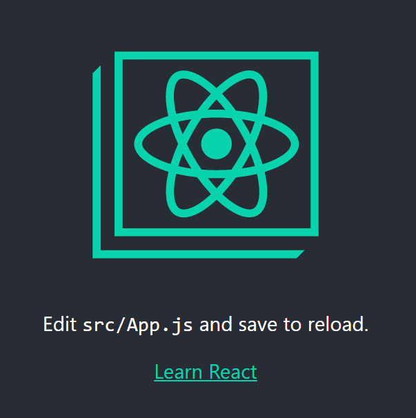

# Création du projet React

## Installer le module de création d'application via NPM

Pour créer un projet React, il faut au préalable avoir installé le module de création via NPM (si vous n'avez pas NPM, retour [case départ](../readme.md) )

Dans le terminal de votre machine, lancez cette commande pour installer le module `create-react-app` de manière globale
```
npm install -g create-react-app
```

## Créer l'application

Depuis le terminal, naviguer vers le dossier où vous souhaitez créer votre nouveau projet React, et ensuite lancer la commande 
```
create-react-app nom-appli-react
```

**Note:** Si la commande ne fonctionne pas, essayez de mettre `npx` au début de la commande

```
npx create-react-app nom-appli-react
```

## Lancement de l'appli

Pour lancer l'appli, il suffit de le lancer via NPM tout en étant sur le dossier du projet.
```
npm start
```

Ou alors, si vous utilisez Yarn:

```
yarn start
```

Cela va lancer l'appli via un serveur local et va ouvrir automatiquement une page web à l'adresse correspondant.

Local : [localhost:3000](http://localhost:3000/)

Network : [http://172.20.2.86:3000/](http://172.20.2.86:3000/)

La page va se recharger automatiquement quand on enregistre des modification dans notre projet, donc pas besoin de toujours rafraîchir la page.




Dans le chapitre suivant je vous expliquerai l'arborescence de notre site et on procédera à quelque nettoyage pour supprimer ce qu'on à sur notre page et avoir une page bien blanche.


[=> Chapitre suivant](04-structure.md)

