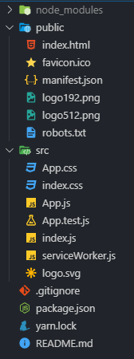
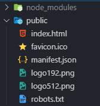
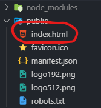
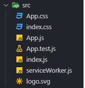
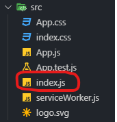
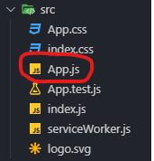
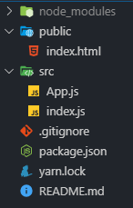
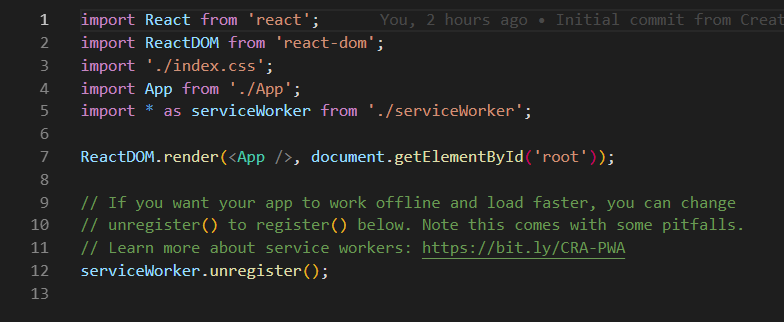
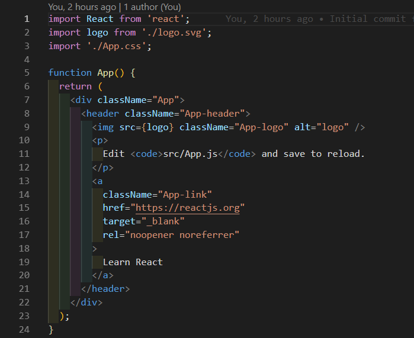
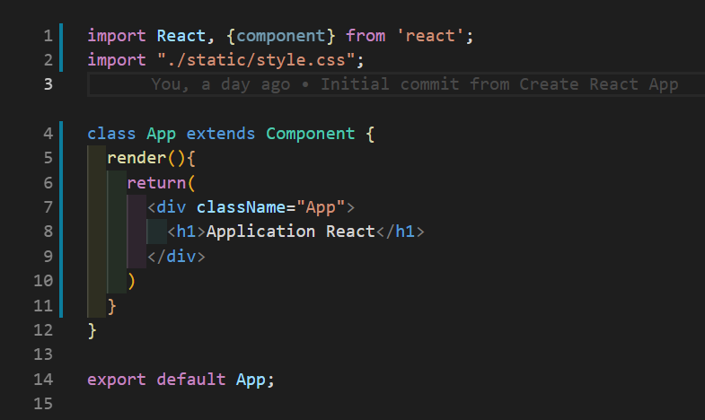

# La structure de base

Lors de la création d'une application React, la structure de l'application ressemble à comme ci-dessous:



## Le dossier public

Le dossier public contient tous les fichiers qui seront placés à la racine du dossier lors de la compilation d'une application React.



Il n'y a qu'un élément important dans le dossier public:

* **Le fichier index.html** est l'unique page internet qui existera dans notre application React, c'est lui qui chargera et affichera notre application React. Il contient également les éléments de base de toute page HTML comme le title, meta, favicon et l'import des scripts. C'est donc ici que vous pourrez changer le titre et la description et la favicon de votre application ou autres balises meta et il ne servira qu'à ça.



## Le dossier src

C'est ici que contiendra tout le coeur de notre application, il n'y a que quelques fichiers importants à prendre en compte:



* **Le fichier index.js** est celui qui s'occupera du rendu de notre application. On y touchera que très peu lors de notre workshop et on y retouchera plus jamais.



* **Le fichier App.js** est celui qui accueillera le contenu de notre page, c'est ici qu'on construira notre application.



## Nettoyage des fichiers inutiles

Tous les autres fichiers que je n'ai pas cités au-dessus sont inutiles pour la création de notre application, je vais quand même vous fournir quelques explications sur ces fichiers:

* Le fichier **manifest.json** n'est pas nécessaire dans notre projet mais il est utilisé lorsque la page est enregistrée dans l'écran d'accueil d'un smartphone ou d'un ordinateur, il contiendra le nom de l'application, les différents formats d'icônes, la couleur de fond etc...

* Le fichier **robot.txt** sert pour le protocole d'exclusion des *web crawlers* (les robots d'exploration)

* Le fichier **serviceWorker.js** est un script qui est exécuté en tâche de fond et qui permet de gérer des notifications push, la synchronisation d'arrière-plan, d'intercepter des requêtes réseau et gérer le cache, ce qui est complètement inutile dans notre cas.

*  Le fichier **App.test.js** est utilisé lorsqu'on lance des tests dans un environnement isolé, un sujet qui n'est pas du tout abordé dans ce test et qui n'est pas nécessaire dans le fonctionnement d'une application React.

* Les fichiers **CSS** ne sont utilisés que pour la mise en page de la page d'introduction généré lors de la création de l'application. On vous fournira un CSS déjà créé donc ces fichiers ne sont absolument pas nécessaire.

* Les images et logo dans chaque dossier ne sont plus utiles non plus .



---

# Nettoyage de index.js et App.js

Notez qu'après nettoyage des fichiers inutiles, notre application sera cassée, il faudra donc supprimer quelques lignes de codes dans `App.js` et `index.js` pour que notre application fonctionne de nouveau. On va également supprimer les lignes inutiles générées par la création de l'application.

## index.js



Dans ce fichier on supprimera l'importation du fichier CSS et tout ce qui concerne le serviceWorker.js, il ne restera donc plus que 4 lignes de code dans l'index.js

```js
import React from 'react';
import ReactDOM from 'react-dom';
import App from './App';

ReactDOM.render(<App />, document.getElementById('root'));
```

## App.js



On a supprimé le svg et les css, donc on peut supprimer la ligne qui importe ces fichiers à la ligne 2 et 3.

On peut aussi supprimer tout ce que contient la div avec la class `app`. Vous pouvez aussi ajouter un petit élément `<h1>` pour tester si le rendu fonctionne bien.

Pour que vous compreniez mieux comment le `state` fonctionne, on va transformer notre fonction en class et modifier notre importation de React à la première ligne, étant donné que le rendu fonctionne différement dans une class. Il faudra aussi ajouter un `Render(){}` avant le return.

Voici le résultat final pour notre App.js

```js
import React, {Component} from 'react';

class App extends Component {
  render(){
    return (
      <div className="app">
        <h1>Application React</h1>
      </div>
    );
  }
}

export default App;

```

---

## Ajout des fichiers nécessaire à notre workshop

Rendez-vous sur [ce lien](https://we.tl/t-77WKnEQNA3) pour télécharger un fichier ZIP qui contient un fichier CSS et des images dont vous aurez besoin.

Téléchargez le contenu de ce dépot au format ".ZIP", compressez-le, prenez le dossier `static` et déposez-le dans le dossier `src` de votre projet.

Vous devrez ensuite importer notre nouveau fichier CSS en ajoutant une ligne au début du fichier `App.js`

```js
import "./static/style.css";
```

Comme ceci : 



[Chapitre suivant =>](05-component.md)