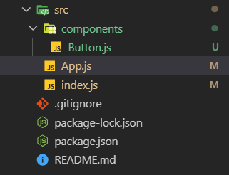

# Les components

Pour mieux comprendre comment un component fonctionne, on va comparer notre application à une maison: l'application est notre maison et les components sont les briques qui constituent notre maison.


Un component est fait à partir d'un fichier séparé qu'on exporte vers notre application (ou vers un autre component). Ce component sera généralement constitué d'une section bien spécifique d'une application. On pourrais par exemple créer un component juste pour un formulaire et un autre component juste pour afficher une liste.

Avant de créer notre premier component, on va d'abord créer un dossier au nom de `components` dans le dossier `src`. Ce sera dans ce dossier qu'on créera tous nos component.

Dans ce dossier `components` on va créer un nouveau fichier `Button.js` (ne pas oublier la majuscule)



Dans ce fichier on va d'abord lui demander d'importer React.

```js
import React from 'react';
```

Ensuite on va créer une fonction qui portera le même nom que le fichier et on va lui dire de l'exporter, la fonction aura comme argument `props` dont je vous fournirais l'explication plus tard.

```js
function Button (props){
	
}

export default Button;
```

A l'intérieur de cette fonction, on va lui demander de retourner un boutton en HTML

```js
function Button (props){
	return <button className='button'>Mon bouton</button>
}
```
Félicitation vous venez de réaliser votre 1er component


---

## Le JSX

La premier question que vous allez sans doute vous poser: *Mais pourqoi un élément HTML dans un JavaScript et sans guillemets??*

C'est ce qu'on appelle le JSX, React nous permets d'écrire du HTML à l'intérieur du JavaScript et React le comprendra parfaittement. Ce qui constitue une excellente aide visuelle et simplifie grandement les choses.

Chose à noter est qu'on ne peut pas mélanger des expression et du JSX en même temps, on utilisera des moustaches `{ }` pour y mettre nos expressions.

```js
// Exemple
let element = (
	<h1>Bonjour monsieur {nom} {prenom}</h1>
)
```

Autre chose aussi c'est qu'on ne peut pas mettre deux balises dans le début d'un élément retourné ou rendu

```js
// Cet exemple retournera une erreur
function Accueil () {
	return (
		<h1> Bienvenue </h1>
		<p>Bienvenue sur notre site!</p>
	)
}
```

Un simple moyen de contourner ce problème est de mettre une `<div>` avant, ou même une balise vide.

```js
// Exemple qui contourne ce problème
function Accueil () {
	return (
		<>
			<h1> Bienvenue </h1>
			<p>Bienvenue sur notre site!</p>
		</>
	)
}
```


---

Sur cette parenthèse terminé, on va retourner sur notre fichier `app.js`

Pour intégrer notre nouveau component, on va d'abord l'importer. On écrit donc `import`, le nom du composant, `from` avec le chemin vers le fichier JavaScript (sans l'extention .js)

```js
import Button from './components/Button'
```

Ensuite pour l'appeler et l'intégrer dans notre page, on se sert tout simplement d'une balise HTML avec le nom de notre component à l'intérieur

```js
// class App extends Component {
//  render(){
//    return (
//      <div className="App">
//        <h1>Application React</h1>
		 <Button/>
//      </div>
//    );
//  }
//}
```

Vous verrez apparaitre notre boutton créé dans l'autre fichier JS

## Les props

Les props sont un moyen de faire passer des données vers un autre component, c'est un peu comme des arguments dans une fonction.

### Faire passer un prop

Pour faire passer un prop, on écrit tout simplement le nom de notre prop à l'intérieur de la balise qui appelle le component suivi de la valeur qu'on souhaite lui passer (exactement comme quand on veut mettre un attribut dans une balise HTML)

```js
<Button text='Start game!'/>
```

Dans l'exemple ci-dessus, on va lui faire passer un prop au nom de `text` avec comme valeur un string `'Start game!'`

### Lire un prop

Tous les props qui ont étés envoyés seront stockés dans un objet `props`. Le texte qu'on a fait passé dans `app.js` sera donc dans `props.text`

On va donc modifier notre code dans `Button.js` pour afficher cette valeur dans notre boutton.js

```js
return <button className='button>{props.text}</button>
```

Vous verrez donc le texte `Start game!` qui à été défini depuis l'appel du component de `App.js`

[=> chapitre suivant](06-state.md)