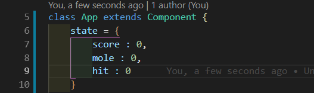
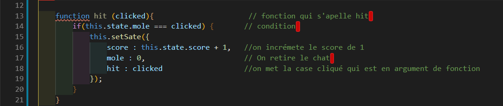
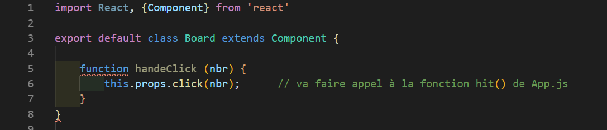

# Board

Comme pour notre fichier `Button` , nous allons créer un nouveau component et celui-ci se nommera `board.js`, dans notre dossier `components`.

```js
import React, { Component } from 'react'

// [...]

export default class Board extends Component {

}
    render(){
            return(
                // [...]
            )
}
```

Retournons dans le fichier `App.js`, car beaucoup de chose nous attende la bas . 
D'abord commençons par ajouter l'importation de notre component `Board`

```js
import Board from './components/Board';
```

## Maintenant accrochez-vous bien  !


Rendez-vous dans notre objet `state` et ajoutez ceci.



Ce que nous venons d'ajouter servira pour pour l'incrémentation des cases cliqué ( hit ) et des chats ( mole ).

Le but maintenant est de faire une fonction qui, quand on clique sur la case ou sur le chat permerttra d'incrémenter le score , de retirer le chat de la case qui a été cliquée .




Une fois notre fonction terminée il nous reste plus cas faire une chose . 
Dans le fichier `Board` , il faut faire appelle a notre fonction fraichement crée , et comment fait-on cela ? 

Simple , il suffit d'utilisé un prop regarder 




(demander a fred pour terminer demain matin 
)

[chapitre suivant =>](08-final.md)