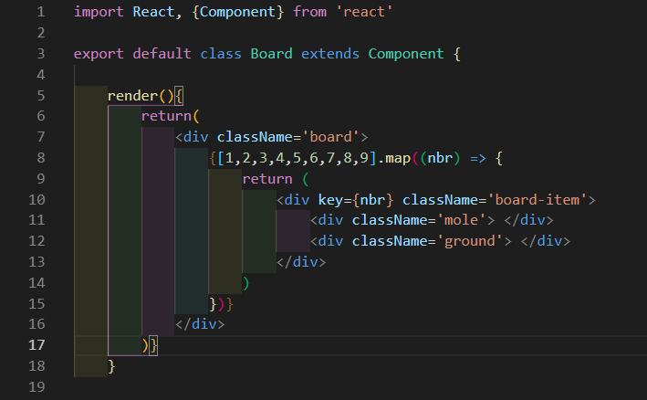

# Board

Comme pour notre fichier `Button.js` , nous allons créer un nouveau component et celui-ci se nommera `Board.js`, dans notre dossier `components`.

```js
import React, { Component } from 'react'

// [...]

export default class Board extends Component {

}
    render(){
        return (
            <h1>Board component</h1> 
            {/* C'est bien de mettre un titre au début pour vérifier si il fonctionne bien */}
    ) 
}
```

Retournons dans le fichier `App.js`, car beaucoup de choses nous attendent là-bas.
D'abord commençons par ajouter l'importation de notre component `Board`.


```js
import Board from './components/Board';
```


On va ensuite afficher notre component entre le score et le bouton déjà présent:

```js
// [...]
//	<p>{this.state.score}</p>
	<Board/>
//	<Button text='Start game!' click={this.incrementScore.bind(this)}/>
// [...]
```


Si tout se passe bien, vous devriez voir le titre qu'on à mis en guise de test s'il fonctionne bien.


## Construction de base du plateau

On va ensuite faire la structure de base du plateau, on va se servir des classes déjà construites avec le CSS qu'on vous a fourni. Remplacez le titre h1 dans le fichier `Board` par ce qui suit dessous:

```js
<div className='board'>
  <div className='board-item'>
    <div className='cat'> </div>
    <div className='ground'> </div>
  </div>
</div>
```

## Re-création dynamique des trous de chats

Une astuce pour créer un élément plusieurs fois est de faire une `map()` dans un tableau avec une suite de chiffres avec le nombre d'éléments que vous voulez avoir. Comme on voudra neuf trous, on fera un tableau de 1 à 9. `[1,2,3,4,5,6,7,8,9]`

On va donc appliquer cette méthode pour ajouter neuf board-item.

```js
return(
    <div className='board'>
        {[1,2,3,4,5,6,7,8,9].map((nbr) => {
            return(
                <div key={nbr} className='board-item'>
                    <div className='cat'> </div>
                    <div className='ground'> </div>
                </div>
            )
        })}
    </div>
)
```

Voici à quoi devra ressembler votre fichier `Board` en toute logique, sinon... Recommencez-vous avez manqué une étape !

> 


**REMARQUES:**

Pour rappel, comme ce n'est pas du JSX mais du JavaScript, on enferme tout ça entre des moustaches.

Aussi, si on ajoute une propriété `key ` à notre div, c'est parce que React n'aime pas qu'on ré-utilise un élément plusieurs fois sans qu'ils n'aient un identifiant propre à chacun, on a donc utilisé notre argument nbr pour qu'ils aient chacun leur chiffre en tant que key.

[Chapitre suivant =>](08-chats.md)